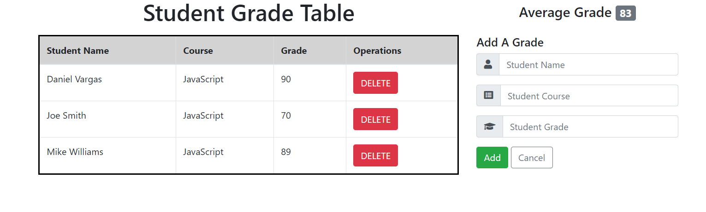

# Student Grade Table
An interactive JavaScript application that communicates with a server to manage grade records.

## Live Demo
<a href="https://daniel-vargas96.github.io/student-grade-table/" target="_blank">Student Grade Table</a>
</img>

## Technologies Used:
* Vanilla JS
* HTML5
* CSS3 
* Bootstrap 4

## Current Feature List:
* User can view all student grades
* User can add a new grade
* User can delete a grade

## Planned Additions:
* User can update a grade
* User can update student names

## Takeaways:
This project was my first introdution to building a CRUD app, and I faced many challenges during the development of it. 
I learned a great deal in splitting up a project into specific components, each with their own functionality. This allowed to gain a different perspective 
of the process that goes into building a large scale project. Although this project used pure Vanilla JS, I walked away from this application having understood the fundamentals
of a CRUD app and how to efficiently develop one. 
